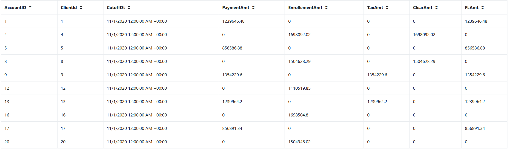

# Проект № 4.

## Клиенты и счета.

Все операции должны считаться локально.

Исходные таблицы ниже.

### 1. Таблица клиентов 10 000 записей

|Поле| Описание
|-------- | ----------|
| ClientId| Id клиента|
| ClientName | Наименование клиента |
| Type | Тип клиента (ФЛ. ЮЛ) |
| Form | Организационно-правовая форма|
| RegisterDate | Дата регистрации клиента
 

### 2. Таблица счетов – 20 000 записей     

|Поле| Описание
|-------- | ----------|
| AccountId| Id счета (pk) |
| AccountNum | Номер счета |
| ClientId | Id клиента владельца счета (fk) |
| DateOpen | Дата открытия счета

### 3. Операции по счетам – 100 000 записей

  |Поле| Описание
|-------- | ----------|
| AccountDB| Счет дебета проводки (fk)|
| AccountCR | Счет кредита проводки (fk) |
| DateOp | Дата операции|
| Amount | Сумма операции|
| Currency | Валюта операции
| Comment | Назначение платежа

### 4. Курсы валют по отношению к рублю

|Поле| Описание
|-------- | ----------|
| Currency | Валюта |
| Rate | Курс |
| RateDate | Дата курса |

 
## Необходимо сформировать три витрины на следующие даты:

### 2020-11-01, 2020-11-02, 2020-11-03, 2020-11-04.

### 1. Витрина _corporate_payments_. Строится по каждому уникальному счету (AccountDB  и AccountCR) из таблицы Operation. Ключ партиции CutoffDt

|Поле| Описание
|-------- | ----------|
| AccountId| Id счета|
| ClientId| Id клиента|
| PaymentAmt | Сумма операций по счету, где счет клиента указан в дебете проводки |
| EnrollementAmt | Сумма операций по счету, где счет клиента указан в кредите проводки |
| TaxAmt | Сумму операций, где счет клиента указан в дебете, и счет кредита 40702 |
| ClearAmt | Сумма операций, где счет клиента указан в кредите, и счет дебета 40802|
| CarsAmt | Сумма операций, где счет клиента указан в дебете проводки и назначение платежа не содержит слов по маскам Списка 1
| FoodAmt | Сумма операций, где счет клиента указан в кредите проводки и назначение платежа содержит слова по Маскам Списка 2
| FLAmt | Сумма операций с физ. лицами. Счет клиента указан в дебете проводки, а клиент в кредите проводки – ФЛ.
| CuttoffDt | Дата операции
 

### 2. Витрина _corporate_account_. Строится по каждому уникальному счету из таблицы Operation на заданную дату расчета. Ключ партиции CutoffDt

|Поле| Описание
|-------- | ----------|
| AccountId| Id счета|
| AccountNum| Номер счета|
| DateOpen | Дата открытия счета |
| ClientId | Id клиента |
| ClientName | Наименование клиента |
| TotalAmt | Общая сумма оборотов по счету. Считается как сумма PaymentAmt и EnrollementAmt|
| CuttoffDt | Дата операции
        

### 3. Витрина _corporate_info_. Строится по каждому уникальному клиенту из таблицы Operation. Ключ партиции CutoffDt

|Поле| Описание
|-------- | ----------|
| ClientId | Id клиента |
| ClientName | Наименование клиента |
| CuttoffDt | Дата операции
| Type | Тип клиента (ФЛ. ЮЛ) |
| Form | Организационно-правовая форма|
| RegisterDate | Дата регистрации клиента
| TotalAmt | Сумма операций по всем счетам клиент. Считается как сумма corporate_account.total_amt по всем счетам.|
| CutoffDt | Дата операции|
 

Суммы должны быть в национальной валюте, для перевода использовать самый актуальный курс из таблицы курсов.

Таблица списков должна загружаться из постгреса в спарк (локально).

### Список 1:

%а/м%, %а\м%, %автомобиль %, %автомобили %, %транспорт%, %трансп%средс%, %легков%, %тягач%, %вин%, %vin%,%viн:%, %fоrd%, %форд%,%кiа%, %кия%, %киа%%мiтsuвisнi%, %мицубиси%, %нissан%, %ниссан%, %sсанiа%, %вмw%, %бмв%, %аudi%, %ауди%, %jеер%, %джип%, %vоlvо%, %вольво%, %тоyота%, %тойота%, %тоиота%, %нyuнdаi%, %хендай%, %rенаulт%, %рено%, %реugеот%, %пежо%, %lаdа%, %лада%, %dатsuн%, %додж%, %меrсеdеs%, %мерседес%, %vоlкswаgен%, %фольксваген%, %sкоdа%, %шкода%, %самосвал%, %rover%, %ровер%

### Список 2:

%сою%, %соя%, %зерно%, %кукуруз%, %масло%, %молок%, %молоч%, %мясн%, %мясо%, %овощ%, %подсолн%, %пшениц%, %рис%, %с/х%прод%, %с/х%товар%, %с\х%прод%, %с\х%товар%, %сахар%, %сельск%прод%, %сельск%товар%, %сельхоз%прод%, %сельхоз%товар%, %семен%, %семечк%, %сено%, %соев%, %фрукт%, %яиц%, %ячмен%, %картоф%, %томат%, %говя%, %свин%, %курин%, %куриц%, %рыб%, %алко%, %чаи%, %кофе%, %чипс%, %напит%, %бакале%, %конфет%, %колбас%, %морож%, %с/м%, %с\м%, %консерв%, %пищев%, %питан%, %сыр%, %макарон%, %лосос%, %треск%, %саир%, % филе%, % хек%, %хлеб%, %какао%, %кондитер%, %пиво%, %ликер%

## Источник: https://disk.yandex.ru/d/OlYnCPLK4XfHVA

По итогу должно получиться 3 витрины с 4 днями. Каждая витрина – один паркет. Паркетники, как и код необходимо выложить на гитхаб. Технологический стек – sql, scala. Если спарк будет работать медленно – данные необходимо уменьшить. 

## Описание

Проект предназначен для определения суммы выполняемых операций по счетам клиентов.
В качестве исходных данных используются выгрузки .csv. Наиболее оптимальным вариантом обработки данных был выбран инструмент Apache Spark и Scala. Главными преимуществами является быстрая обработка данных и простота преобразований.

## ER-диаграмма
Данные с разным таблиц объединяем с помощью джойнов. За основную таблицу берется таблица с операциями (Operation.csv)

### Установка
Для настройки проекта необходимо было установить Anaconda3 и дополнительно настроить в нем модуль для scala - spylon-kernel.

### Ход выполнения

**1) На первом этапе определили схему данных в соотвествии с заданием.**

**2) Выгрузили данные из .csv файлов в датафреймы. Для столбца с операциями заменили запятые на точки**

**3) Объеденили таблицу со счетами с таблицей с клиентами**

**4) Подтянули таблицу с курсами валют, и примели все валюты к рублевому эквиваленту**  

**5) Далее произвели агрегирование по суммам**  

**6) По полученным данным построены витрины, сохранены в формате parquet для оптимизации хранения** 

## Результаты
В результате получены данные по трем витринам за период четырех дней. Данные результаты сохранены в папку Vitrina.

corporate_payments

corporate_account

corporate_info

